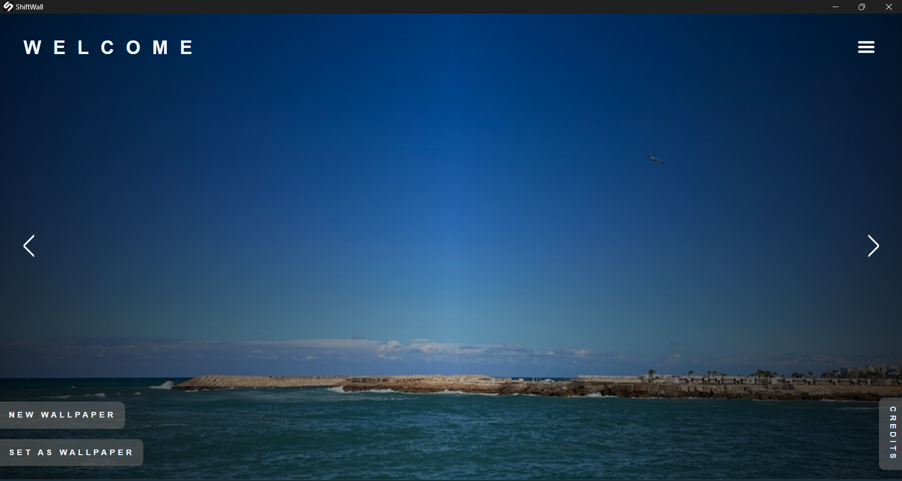
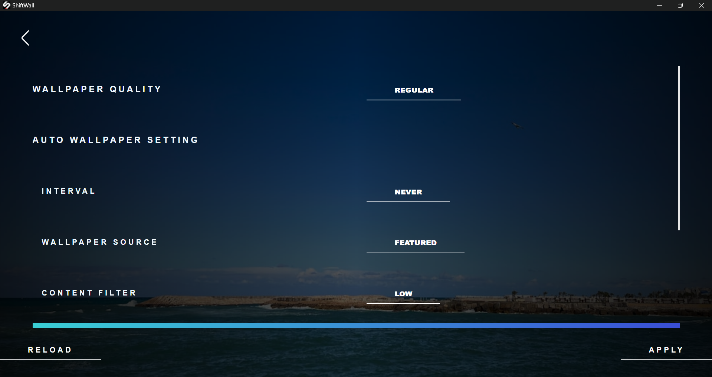
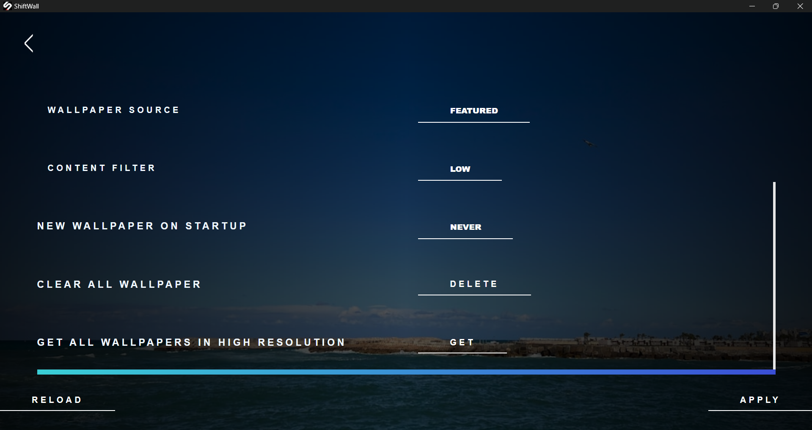

    
    <h1>ShiftWall</h1>
    
An UNOFFICIAL Wallpaper Client Application For Unsplash

---

  
  
  

## Features
- Get a new random wallpaper evertime!
- Wide library of wallpaper from unsplash
- Change wallpaper on the go
- Schedule wallpaper change
- Change wallpaper on start up 
- High res wallpapers
- A wide settings tweaks
- Custom topic wallpaper search
- A fresh and modern ui
- ...

## Steps to aquire Unsplash Api Key
- Unsplash API is simple to use. Here are the steps to get started:
- Create a developer account: create an account -> https://unsplash.com/join
- Once you’re in, go to the Menu -> Product -> Developers/API
- Click on Your Apps on New Application
- Add your application’s name and description(anything you want just to aquire key)
- Then you’ll see “Apply for Production” section, but we’re not interested in that yet, so let’s scroll down to 🔑 Keys section (this is where you’ll need to copy your Access key for API requests)
- At the bottom 🔒Permissions section, select "Public access" (you can select all of them if you want to explore all that the API allows).

## Disclaimer
This project and its contents are not affiliated with, funded, authorized, endorsed by, or in any way associated with Unsplash or any of its affiliates and subsidiaries.

Any trademark, service mark, trade name, or other intellectual property rights used in this project are owned by the respective owners.
